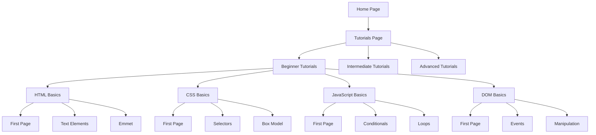
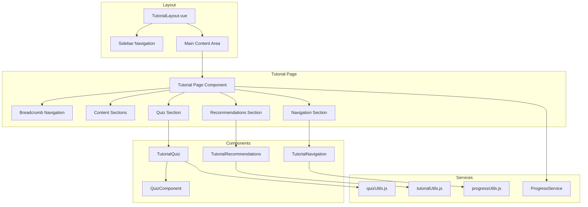
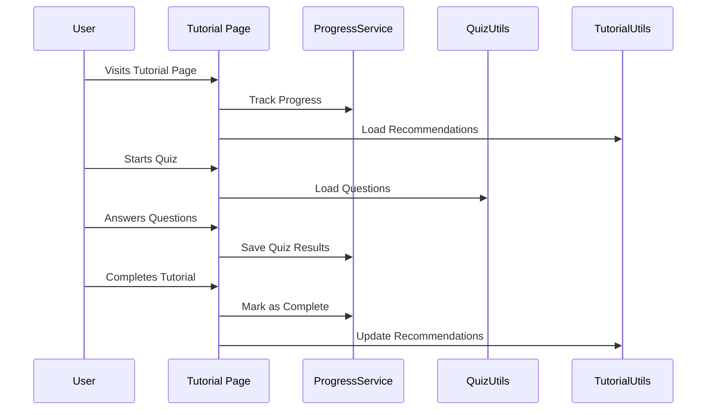
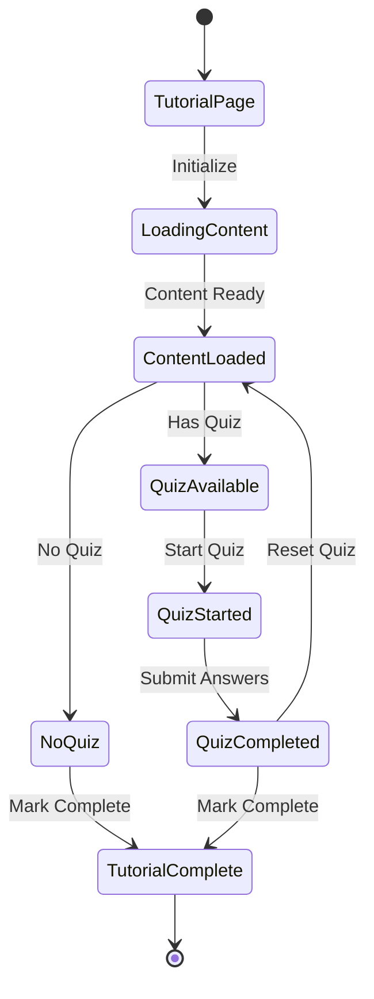
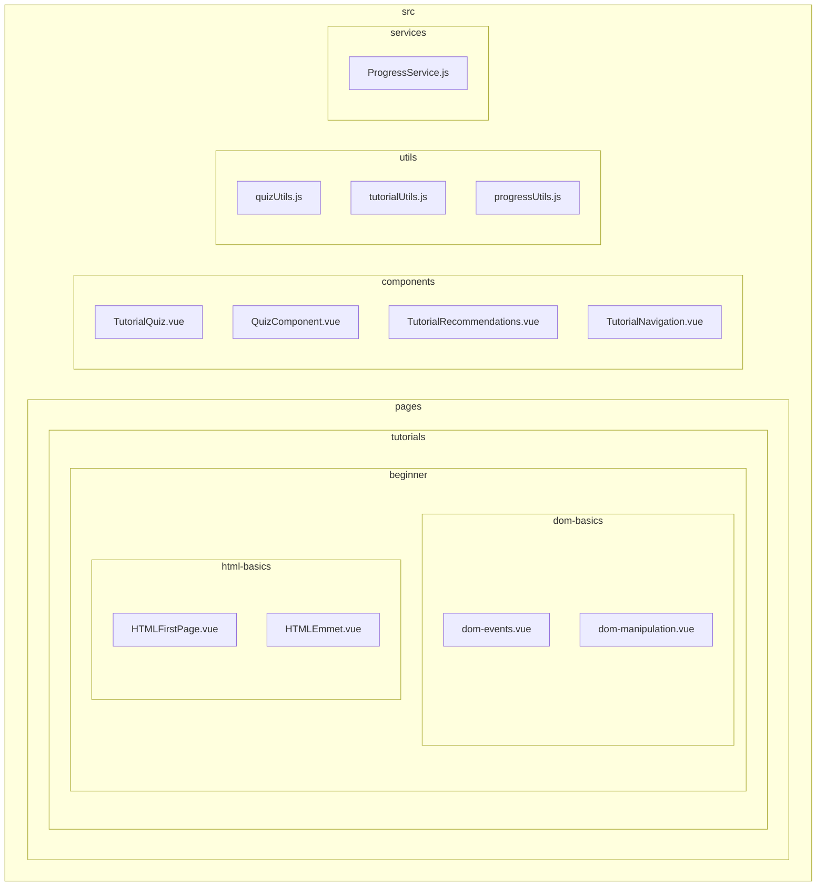

# Tutorial Site Diagrams

This document provides visual diagrams of the tutorial site structure and component relationships using Mermaid.

## Site Structure

## Component Relationships

## Data Flow

## Component State Management

## File Structure

## Notes

1. The diagrams use Mermaid syntax and can be rendered by any Markdown viewer that supports Mermaid.
2. The site structure diagram shows the main navigation hierarchy.
3. The component relationships diagram shows how different components interact.
4. The data flow diagram illustrates the sequence of operations during user interaction.
5. The state diagram shows the different states a tutorial page can be in.
6. The file structure diagram shows the physical organization of the codebase.

## Related Documentation

- [TUTORIAL_STRUCTURE.md](./TUTORIAL_STRUCTURE.md) - Detailed component documentation
- [QUIZZES.md](./QUIZZES.md) - Quiz system documentation
- [RECOMMENDATIONS.md](./RECOMMENDATIONS.md) - Recommendations system documentation 