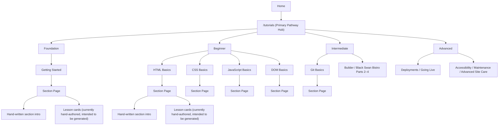
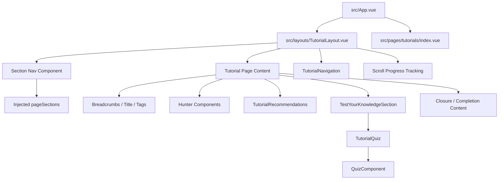
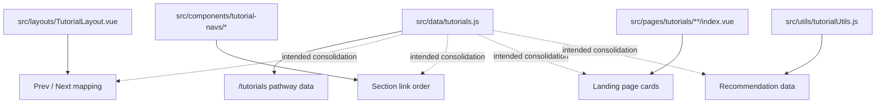
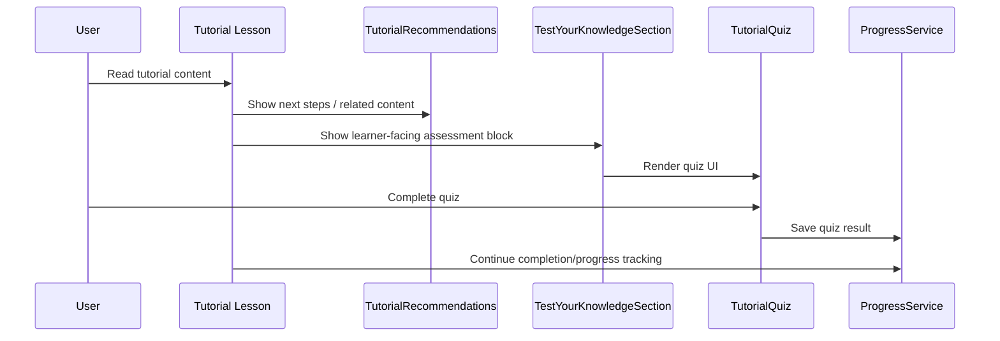
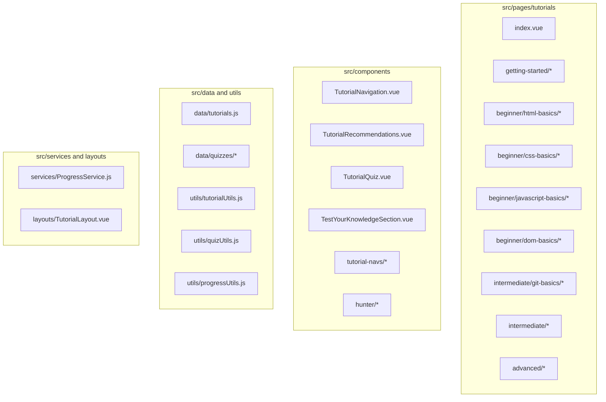

# Tutorial Site Diagrams

Status: partially current. These diagrams reflect the current tutorial system and the clarified pathway direction, while noting that some sequence/navigation logic is still transitional in the codebase.

## Pathway Structure

```mermaid
graph TD
    Home["Home"] --> Tutorials["/tutorials (Primary Pathway Hub)"]

    Tutorials --> Foundation["Foundation"]
    Tutorials --> Beginner["Beginner"]
    Tutorials --> Intermediate["Intermediate"]
    Tutorials --> Advanced["Advanced"]

    Foundation --> GettingStarted["Getting Started"]

    Beginner --> HTML["HTML Basics"]
    Beginner --> CSS["CSS Basics"]
    Beginner --> JS["JavaScript Basics"]
    Beginner --> DOM["DOM Basics"]

    Intermediate --> Git["Git Basics"]
    Intermediate --> Builder["Builder / Black Swan Bistro Parts 2–4"]

    Advanced --> Deploy["Deployments / Going Live"]
    Advanced --> Care["Accessibility / Maintenance / Advanced Site Care"]

    GettingStarted --> GSIndex["Section Page"]
    HTML --> HTMLIndex["Section Page"]
    CSS --> CSSIndex["Section Page"]
    JS --> JSIndex["Section Page"]
    DOM --> DOMIndex["Section Page"]
    Git --> GitIndex["Section Page"]

    GSIndex --> GSIntro["Hand-written section intro"]
    GSIndex --> GSCards["Lesson cards (currently hand-authored, intended to be generated)"]

    HTMLIndex --> HTMLIntro["Hand-written section intro"]
    HTMLIndex --> HTMLCards["Lesson cards (currently hand-authored, intended to be generated)"]
```

## Shared Tutorial System

```mermaid
graph TD
    App["src/App.vue"] --> TutorialLayout["src/layouts/TutorialLayout.vue"]
    App --> TutorialsHub["src/pages/tutorials/index.vue"]

    TutorialLayout --> SidebarNav["Section Nav Component"]
    TutorialLayout --> MainContent["Tutorial Page Content"]
    TutorialLayout --> PrevNext["TutorialNavigation"]
    TutorialLayout --> Progress["Scroll Progress Tracking"]

    SidebarNav --> PageSections["Injected pageSections"]

    MainContent --> Breadcrumbs["Breadcrumbs / Title / Tags"]
    MainContent --> Hunter["Hunter Components"]
    MainContent --> Recommendations["TutorialRecommendations"]
    MainContent --> Assessment["TestYourKnowledgeSection"]
    MainContent --> Closure["Closure / Completion Content"]

    Assessment --> TutorialQuiz["TutorialQuiz"]
    TutorialQuiz --> QuizComponent["QuizComponent"]
```

## Current Data And Logic Split

```mermaid
graph TD
    Curriculum["src/data/tutorials.js"] --> TutorialsHubData["/tutorials pathway data"]

    TutorialUtils["src/utils/tutorialUtils.js"] --> Recommendations["Recommendation data"]
    TutorialLayout["src/layouts/TutorialLayout.vue"] --> PrevNext["Prev / Next mapping"]
    SectionNavs["src/components/tutorial-navs/*"] --> SidebarOrder["Section link order"]
    SectionPages["src/pages/tutorials/**/index.vue"] --> LandingCards["Landing page cards"]

    Curriculum -. intended consolidation .-> PrevNext
    Curriculum -. intended consolidation .-> SidebarOrder
    Curriculum -. intended consolidation .-> LandingCards
    Curriculum -. intended consolidation .-> Recommendations
```

## Assessment And Recommendation Flow

```mermaid
sequenceDiagram
    participant User
    participant Lesson as Tutorial Lesson
    participant Rec as TutorialRecommendations
    participant Assess as TestYourKnowledgeSection
    participant Quiz as TutorialQuiz
    participant Progress as ProgressService

    User->>Lesson: Read tutorial content
    Lesson->>Rec: Show next steps / related content
    Lesson->>Assess: Show learner-facing assessment block
    Assess->>Quiz: Render quiz UI
    User->>Quiz: Complete quiz
    Quiz->>Progress: Save quiz result
    Lesson->>Progress: Continue completion/progress tracking
```

## File Structure Snapshot

```mermaid
graph TD
    subgraph "src/pages/tutorials"
        TutorialsIndex["index.vue"]
        GettingStarted["getting-started/*"]
        BeginnerHTML["beginner/html-basics/*"]
        BeginnerCSS["beginner/css-basics/*"]
        BeginnerJS["beginner/javascript-basics/*"]
        BeginnerDOM["beginner/dom-basics/*"]
        IntermediateGit["intermediate/git-basics/*"]
        IntermediateBuilder["intermediate/*"]
        AdvancedPages["advanced/*"]
    end

    subgraph "src/components"
        TutorialNavigation["TutorialNavigation.vue"]
        TutorialRecommendations["TutorialRecommendations.vue"]
        TutorialQuiz["TutorialQuiz.vue"]
        TestYourKnowledge["TestYourKnowledgeSection.vue"]
        TutorialNavs["tutorial-navs/*"]
        Hunter["hunter/*"]
    end

    subgraph "src/data and utils"
        TutorialsData["data/tutorials.js"]
        QuizData["data/quizzes/*"]
        TutorialUtils["utils/tutorialUtils.js"]
        QuizUtils["utils/quizUtils.js"]
        ProgressUtils["utils/progressUtils.js"]
    end

    subgraph "src/services and layouts"
        ProgressService["services/ProgressService.js"]
        TutorialLayout["layouts/TutorialLayout.vue"]
    end
```

## Important Notes

- `/tutorials` is the primary pathway entry point.
- Section pages are secondary drill-down pages.
- Git Basics is positioned under the intermediate level in the current project direction.
- `TestYourKnowledgeSection` is the preferred learner-facing assessment wrapper.
- Some sequence, recommendation, and landing-page logic is still duplicated in the codebase and has not yet been fully centralized into `src/data/tutorials.js`.

## Related Docs

- [TUTORIAL_STRUCTURE.md](./TUTORIAL_STRUCTURE.md)
- [CREATE_NEW_TUTORIAL.md](./CREATE_NEW_TUTORIAL.md)
- [QUIZZES.md](./QUIZZES.md)
- [RECOMMENDATIONS.md](./RECOMMENDATIONS.md)
- [roadmap.md](./roadmap.md)
